# Hi there, I'm Bhaskar Maity 👋

  

---

### 🌐 Connect with Me:
 
 
 

---

### 💻 Tech Stack:

 

  
  
  
  
  
  
  
  
  
  
  
  
  
  
  
  

---

### 📊 GitHub Analytics:

  
  

  
  

---
<!--
### 📈 Activity & Contribution Graph:

  

 -->
---

### 🚀 Featured Projects:

| Project | Description | Tech Stack |
| :--- | :--- | :--- |
| <b><a href="https://github.com/VirUsFly">Project One</a></b> | Short description of key features and functionality. | `Python` `AWS` `SQLite` |
| <b><a href="https://github.com/VirUsFly">Project Two</a></b> | Short description of key features and functionality. | `Java` `Azure` `MariaDB` |
| <b><a href="https://github.com/VirUsFly">Project Three</a></b> | Short description of key features and functionality. | `PHP` `Nginx` `Bash` |

---

### 🐍 Snake Eating My Contributions:

<!-- Snake Game Repo View -->

<picture>
  <source media="(prefers-color-scheme: dark)" srcset="https://raw.githubusercontent.com/VirUsFly/VirUsFly/output/github-contribution-grid-snake-dark.svg">
  <source media="(prefers-color-scheme: light)" srcset="https://raw.githubusercontent.com/VirUsFly/VirUsFly/output/github-contribution-grid-snake.svg">
  
</picture>

---

### ✍️ Dev Quote & Profile Visits:

    
  

